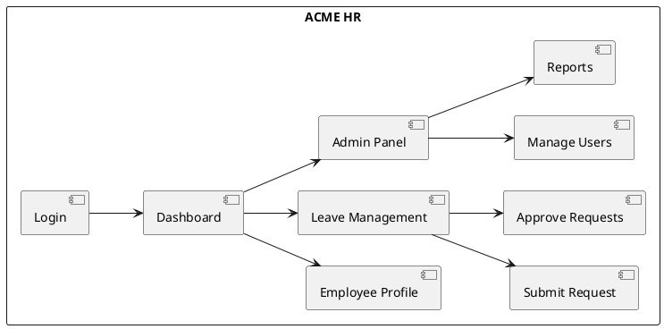
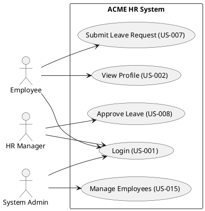
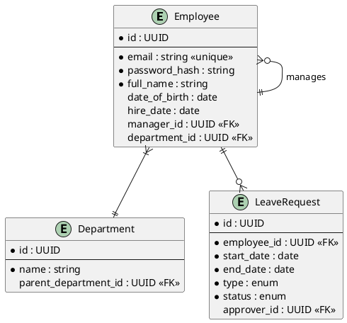
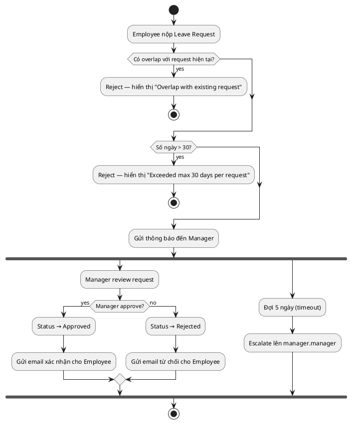
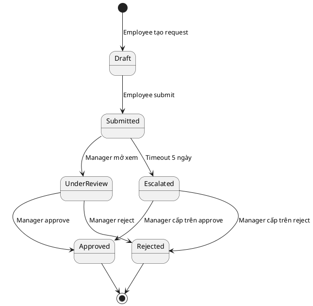

# Module M2 PRD — BA Documentation Generator

| Trường            | Giá trị                           |
| ------------------ | -------------------------------- |
| **Module**         | M2 — BA Documentation Generator  |
| **Phiên bản**      | 4.0                              |
| **Ngày tạo**       | 02/05/2026                       |
| **Ngày cập nhật**  | 04/06/2026                       |
| **Trạng thái**     | Draft                            |
| **Owner**          | [TBD]                            |
| **Liên quan**      | PRD v1.3 §6.2, §10 (Milestone 2); ADR-001 (Markdown-First); Module M1 PRD |
| **Milestone**      | Milestone 2 — M2 BA Live (6 tuần sau M1) |
| **Module ship được dùng độc lập** | Có — cũng có thể dùng standalone (BA tự fill brief, không cần M1) |

---

## 1. Tổng quan module

### 1.1. Mục đích

M2 chuyển từ **estimate đã chốt** (output của M1) thành **bộ tài liệu BA (Business Analyst) đầy đủ, có cấu trúc, traceable** — input nền tảng cho M3 (test), M4 (kanban), M5 (dev agent).

> **Triết lý:** M2 không thay BA, mà biến BA từ "người gõ tài liệu" thành "người verify và adjust output AI" — focus vào nghiệp vụ và edge case, không tốn thời gian format tài liệu.

### 1.2. Vai trò chiến lược

M2 là module **rủi ro cao nhất** trong tam giác M1-M2-M3 vì:

- **Mọi module phía sau đọc requirement của M2.** Nếu requirement sai/ambiguous → cascade lỗi xuống test, code, deploy.
- **Schema requirement và user story là contract** giữa các module ANSO. Schema sai → toàn bộ pipeline cần migration.
- **BA artifact cần auditable cho client.** Outsourcing context: client review tài liệu BA trước khi approve dự án.

Vì vậy M2 phải:

1. Có schema chuẩn rõ ràng, versionable.
2. Có validation chặt (ambiguous, mâu thuẫn, thiếu AC — Acceptance Criteria).
3. Có change request workflow để xử lý requirement thay đổi an toàn.
4. Có traceability matrix tự động (REQ ↔ US ↔ TC ↔ TASK).

### 1.3. Vấn đề cụ thể đang giải quyết

| Pain hiện tại | Hệ quả | M2 giải quyết |
| ------------- | ------ | ------------- |
| BA viết tay từng SRS, mỗi dự án 1 format | Client review khó, brand inconsistent | Template chuẩn, sinh tự động từ M1 |
| Requirement ambiguous → dev hỏi BA → wait cycle | Slow throughput | BA Copilot detect ambiguity sớm, đặt câu hỏi gợi mở |
| Thay đổi requirement = sửa nhiều file rời rạc | Mất sync, miss nơi cần update | Change request workflow flag toàn bộ artifact downstream |
| Diagram (ERD, sequence) tách rời text | Mỗi lần đổi requirement phải vẽ lại | PlantUML text-based, agent edit được |
| Test team không biết requirement đổi | Test case lỗi thời | Auto-link REQ → TC, alert khi REQ thay đổi |
| Tài liệu Việt/Anh duplicate | Effort gấp đôi | Bilingual support trong cùng schema |

### 1.4. Outcome target sau khi M2 live

| Metric | Trước M2 | Sau M2 |
| ------ | -------- | ------ |
| Thời gian tạo SRS đầy đủ cho dự án trung | 2-3 tuần | 3-5 ngày |
| % requirement có ID + AC | 30-50% (manual nhớ) | 100% (enforce schema) |
| Thời gian xử lý change request 1 requirement | 1-2 ngày (sửa rời rạc) | 2-4 giờ (auto-flag downstream) |
| Số diagram đồng bộ với code | <50% | >90% (text-based, agent maintain) |
| BA junior tự làm SRS được | Không (cần senior support) | Có (qua Copilot Q&A) |

---

## 2. Personas & User Flows

### 2.1. Primary Personas

**P1 — BA ("Lan")**

- Vai trò: thiết kế nghiệp vụ, viết SRS (Software Requirements Specification), user story, làm việc với client. **Đồng thời** oversight tài liệu BA, dashboard tiến độ, sprint planning, release scheduling, quản 3-5 dự án song song.
- Tần suất: 3-5 dự án song song.
- Pain: tốn thời gian format, sync giữa các tài liệu, context-switch giữa nhiều dự án, phải re-format mỗi dự án 1 kiểu.
- Mục tiêu với M2: từ "viết tay" sang "review + adjust output AI", focus deep nghiệp vụ và edge case, quick review qua diff view, dashboard tổng thể.

### 2.2. Secondary Personas

- **Dev** (downstream "Khoa" — DevOps): consume requirement của M2, cần requirement rõ ràng không ambiguous. Read-only access vào artifact M2 để có context.
- **QA** (downstream "Trang"): consume AC (Acceptance Criteria) cho M3 sinh test case. Read-only access vào artifact M2.

> **Note về visibility:** QA, Dev được assign vào project có read-only access vào artifact M2 — xem ANSO-PRD §7.6.6.

### 2.3. Core User Flow — Happy Path

```
┌─────────────────────────────────────────────────────────────┐
│ Step 1: Nhận input từ M1                                     │
│ Input: anso-docs/01-presale/estimate.md                      │
│        anso-docs/01-presale/brief.md                         │
└──────────────────────┬──────────────────────────────────────┘
                       ▼
┌─────────────────────────────────────────────────────────────┐
│ Step 2: Trigger BA Document Auto-draft                       │
│ Actor: BA (1 click)                                          │
│ ANSO Action: BA Generator Agent (đọc M1 artifacts)           │
│ Output (draft):                                              │
│   - glossary.md                                              │
│   - user-stories/US-001..US-NNN.md                           │
│   - requirements/REQ-001..REQ-NNN.md                         │
│   - non-functional-requirements/NFR-001..NFR-NNN.md          │
│   - diagrams/usecase.puml (skeleton)                         │
│   - diagrams/sitemap.puml (skeleton)                         │
│   - screen-spec/SCREEN-XXX.md (skeleton)                     │
└──────────────────────┬──────────────────────────────────────┘
                       ▼
┌─────────────────────────────────────────────────────────────┐
│ Step 3: BA Copilot Interactive Q&A                           │
│ Actor: BA + Copilot                                          │
│ ANSO Action: detect ambiguity, ask clarifying questions      │
│ Loop:                                                        │
│   - Copilot: "Field X có required không?"                    │
│   - BA: "Required, có default value..."                      │
│   - Copilot updates artifact                                 │
│ Output: artifacts đầy đủ hơn, ambiguity giảm                 │
└──────────────────────┬──────────────────────────────────────┘
                       ▼
┌─────────────────────────────────────────────────────────────┐
│ Step 4: BA review + edit                                     │
│ Actor: BA                                                    │
│ Method:                                                      │
│   - Edit markdown trực tiếp (power user)                     │
│   - Hoặc edit qua form UI render từ schema                   │
│   - Add/remove user story, refine AC                         │
└──────────────────────┬──────────────────────────────────────┘
                       ▼
┌─────────────────────────────────────────────────────────────┐
│ Step 5: Generate Diagrams + Screen Specification             │
│ Actor: BA chọn diagram type → ANSO sinh                      │
│ Diagrams (PlantUML):                                         │
│   - SM-NNN: Sitemap (auto-generated)                         │
│   - UC-NNN: Use case diagram                                 │
│   - ERD-NNN: ERD (Entity Relationship Diagram)               │
│   - SEQ-NNN: Sequence diagram cho luồng quan trọng           │
│   - AD-NNN: Activity diagram cho luồng có nhiều nhánh        │
│   - STM-NNN: State machine nếu có entity với state           │
│ Screen Specification:                                        │
│   - SCREEN-XXX.md per màn hình                               │
│ Output: anso-docs/02-ba/diagrams/*.puml + render PNG/SVG     │
│         anso-docs/02-ba/screen-spec/SCREEN-XXX.md            │
└──────────────────────┬──────────────────────────────────────┘
                       ▼
┌─────────────────────────────────────────────────────────────┐
│ Step 6: Generate Prototype                                   │
│ Actor: BA review                                             │
│ ANSO Action: từ screen spec → ReactJS prototype              │
│ Output: anso-docs/02-ba/prototype/                           │
│   - HTML render trên UI (preview)                            │
│   - Export file .jsx                                         │
└──────────────────────┬──────────────────────────────────────┘
                       ▼
┌─────────────────────────────────────────────────────────────┐
│ Step 7: Validation                                           │
│ ANSO Action:                                                 │
│   - Check 100% REQ có ID + AC + owner                        │
│   - Check không có requirement mâu thuẫn                     │
│   - Check coverage: mỗi feature từ M1 → có ≥ 1 US            │
│   - Check diagram entities ↔ ERD ↔ user stories đồng bộ      │
│   - Check screen spec coverage: mỗi US → có ≥ 1 màn hình     │ 
│ Output: validation-report                                    │
└──────────────────────┬──────────────────────────────────────┘
                       ▼
┌────────────────────────────────────────────────────────────────────┐
│ Step 8: SRS Auto-generate + Advance to M3                           │
│ Trigger: tất cả tab đã có nội dung                                  │
│ ANSO Action: tổng hợp toàn bộ artifact → sinh SRS                   │
│ Effect khi Advance:                                                 │
│   - project current_phase: M2 → M3                                  │
│   - Trigger M3 (test design) + M4 (kanban) auto                     │
│   - [!] Nếu BA là creator → mất quyền xoá project                   │
│   - Members Presale/QA/Dev nhận notification "M2 done, M3+M4 ready" │
└────────────────────────────────────────────────────────────────────┘
```

**Total target time:** 3-5 ngày cho dự án trung bình (vs 2-3 tuần manual).

### 2.4. Alternative Flows

#### 2.4.1. Standalone mode — BA tạo project (M2-start, skip M1)

BA là creator → lifecycle bắt đầu từ M2, không qua M1.

```
1. BA tạo project trên ANSO Control Plane
   - Workspace VM provisioned, repo trống tạo trên GitHub
   - current_phase: M2
   - Workspace UI KHÔNG có tab "Presale (M1)" — M1 module bị bypass
   - Optional: BA assign QA/Dev members ngay khi tạo (incremental,
     có thể add sau)
2. BA upload brief manual hoặc fill form
   - brief.md lưu ở anso-docs/01-presale/ (folder vẫn tồn tại
     làm reference, không trigger M1 logic)
3. Trigger Step 2 trực tiếp (BA Generator đọc brief.md, không cần estimate)
4. Continue như happy path từ Step 3
```

**Use case:** dự án existing đã có estimate ngoài ANSO, hoặc enhancement không cần presale.

**Visibility & lifecycle rules cho BA-created project:**
- Project visible với BA creator + Presale/QA/Dev được assign.
- BA creator xoá được project khi `current_phase == M2`. Sau khi Advance to M3 → mất quyền xoá.
- Cross-reference: ANSO-PRD §7.6.5 (assignment) + §7.6.6 (visibility) + §7.6.8 (deletion).

#### 2.4.2. Presales-handoff mode — BA continue project tạo bởi Sales/Presale

```
Tiền điều kiện: Sales/Presale A đã tạo project ở M1 và đã
                Advance to M2 → current_phase = M2

1. Sales/Presale A assign BA L vào project (qua Project Members panel)
   - Có thể đã assign từ M1 → BA L đã thấy project từ trước
   - Hoặc assign sau khi advance to M2
2. BA L thấy project trong list của mình
   - Other BAs KHÔNG thấy
   - Other Sales/Presale (B, C, ...) KHÔNG thấy
3. BA L workspace có:
   - Tab "Presale (M1)" — Presales vẫn edit được bình thường
   - Tab "BA Documentation (M2)" active (RW)
   - Tab M3-M7 chưa active
4. BA L bắt đầu Step 2 happy path (đọc M1 estimate.md làm input)
5. Note: nếu BA L bị remove khỏi project → project biến mất
   khỏi list của L ngay.
```

#### 2.4.3. Change Request workflow (Loop vòng 2)

Flow này chỉ xuất hiện sau khi M2 đã Advance to M3. Trigger tự động khi QA hoặc Dev chỉnh sửa file trong phase của họ (test case, source code) mà system detect có liên quan đến artifact M2 của BA.

```
┌─────────────────────────────────────────────────────────────┐
│ Trigger: System detect QA/Dev chỉnh sửa file downstream      │
│ liên quan artifact M2 (e.g. test case, source code)         │
└──────────────────────┬──────────────────────────────────────┘
                       ▼
┌─────────────────────────────────────────────────────────────┐
│ Step 1: ANSO Auto-map Change                                 │
│ Action: traverse traceability graph                          │
│ Detect impact:                                               │
│   - Artifact M2 liên quan (REQ-XXX, US-XXX)                 │
│   - Scope thay đổi cụ thể                                   │
│ Output: CR entry tự động tạo trong tab Change Request        │
│         + suggest chỗ cần sửa trong artifact M2             │
└──────────────────────┬──────────────────────────────────────┘
                       ▼
┌─────────────────────────────────────────────────────────────┐
│ Step 2: BA Review CR                                         │
│ Decision:                                                    │
│   a) Accept → AI tự động apply thay đổi vào artifact M2     │
│   b) Reject → CR đóng, artifact M2 giữ nguyên               │
│   c) Manual edit → BA tự sửa, CR đánh dấu resolved          │
└──────────────────────┬──────────────────────────────────────┘
                       ▼
┌─────────────────────────────────────────────────────────────┐
│ Step 3: ANSO Apply (nếu Accept)                              │
│ Actions:                                                     │
│   - Update artifact M2 liên quan                             │
│   - Flag downstream artifacts cần review                     │
│   - Commit với CR reference                                  │
│   - Version file tăng                                        │
└─────────────────────────────────────────────────────────────┘
```

#### 2.4.4. Bilingual workflow

BA viết requirement Việt → ANSO translate sang Anh:

```
1. BA viết user story tiếng Việt trong front matter language: vi
2. Trigger translation → ANSO sinh US-001.en.md
3. BA review English version
4. BA resolve → update cả 2 versions
5. Validation enforce 2 versions sync (qua schema check)
```

---

## 3. Artifacts & Schema

> Tuân theo ADR-001 §4.3. Schema dưới đây là **contract** với M3, M4, M5 — không thay đổi tuỳ tiện.

### 3.1. File Naming Convention

**Tham chiếu nội bộ** (link giữa file, front matter, traceability): dùng tên gốc không kèm version.

```
requirement.md       # tham chiếu đến file functional requirements
userstory.md         # tham chiếu đến file user stories
nfr.md               # tham chiếu đến file NFR
glossary.md
```

**Khi download / export:** file có version suffix `_NNN` (e.g `REQ-001`, `US-007`, `NFR-005`, `SCREEN-001`) tăng mỗi lần BA chỉnh sửa:

| Artifact               | File trong workspace                     | File export                         |
| ---------------------- | ---------------------------------------- | ----------------------------------- |
| Functional Requirements | `requirements/REQ-NNN.md`                | `FunctionalRequirements_001.md`     |
| User Stories           | `user-stories/US-NNN.md`                 | `UserStories_001.md`                |
| Non-Functional Requirements | `non-functional-requirement/NFR-NNN.md`  | `NonFunctionalRequirements_001.md`  |
| Diagrams               | `diagrams/[TYPE]-NNN.puml`               | `diagrams.zip`                      |
| Screen Specification   | `screen-spec/SCREEN-NNN.md`              | `ScreenSpec_001.xlsx`               |
| Glossary               | `glossary.md`                            | `Glossary_001.md`                   |
| Prototype              | `prototype/*.jsx`                        | `Prototype_001.jsx`                 |
| SRS                    | `srs.md` (auto-generated, advance only)  | `SRS_001.md`                        |

### 3.2. Functional Requirements — FR (`anso-docs/02-ba/requirements/REQ-XXX.md`)

**Vai trò:** Atomic unit của business requirement. Source of truth cho mọi downstream artifact.

#### 3.2.1. Schema

```yaml
---
id: REQ-014
type: requirement
title: Hệ thống phải xác thực email/password qua bcrypt
version: 1
created_at: 2026-05-10T11:00:00Z
updated_at: 2026-05-12T15:00:00Z
created_by: ba-generator-agent
updated_by: lan.ba
schema_version: 1

category: functional
sub_category: security
priority: must
source: client_brief
source_ref:
  - type: brief
    section: "2.3 Security Requirements"
    confidence: 0.92

owner: lan.ba
priority_rationale: "MUST do — security baseline yêu cầu bởi GDPR-equivalent compliance"

parent_requirement: null
child_requirements: []
related_user_stories: [US-001, US-002]
related_test_cases: [TC-031]
related_tasks: []
related_screens: [SCREEN-001]

validation:
  has_acceptance_criteria: true
  has_owner: true
  is_unambiguous: true
  is_verifiable: true
  is_testable: true
  conflicts_with: []

translations:
  vi:
    title: "Hệ thống phải xác thực email/password qua bcrypt"
    body_path: REQ-014.vi.md
  en:
    title: "System must authenticate email/password via bcrypt"
    body_path: REQ-014.en.md
---

# REQ-014: Email/Password Authentication via bcrypt

## Statement
The system SHALL authenticate users via email and password, where passwords are hashed using bcrypt with cost factor ≥ 12.

## Rationale
- Compliance: GDPR-equivalent password storage requirement.
- Security best practice for sensitive HR data.
- Resistant to rainbow table attacks at acceptable performance cost.

## Acceptance Criteria

### AC-014.1: Successful authentication with valid credentials
**Given** user has registered with email `user@example.com` and password `Pass123!`
**When** user submits the login form with correct credentials
**Then** system returns JWT token and redirects to dashboard

### AC-014.2: Failed authentication with invalid password
**Given** user has registered
**When** user submits incorrect password
**Then** system returns 401 Unauthorized with message "Invalid credentials"
**And** system logs the failed attempt

### AC-014.3: Account lockout after repeated failures
**Given** user has 5 consecutive failed attempts within 15 minutes
**When** user submits another login attempt
**Then** system returns 423 Locked with message indicating cooldown period
**And** system sends notification email to user

## Constraints
- Bcrypt cost factor configurable (default 12, min 10, max 15)
- Login API rate limit: 10 requests/minute per IP
- Password minimum length: 12 characters

## Assumptions
- Email is the primary identifier (no username separate)
- 2FA not part of this requirement (see REQ-016)

## References
- OWASP Password Storage Cheat Sheet
- Internal: `.anso/conventions/security.md`
```

#### 3.2.2. Quy tắc

- **Mỗi requirement = 1 file**, không nhóm nhiều requirement vào 1 file (tránh diff conflict).
- ID format `REQ-NNN` (3 digits; nếu cần `REQ-NNNN`).
- AC (Acceptance Criteria) có ID format `AC-{REQ_NUM}.{N}` (vd `AC-014.1`) — globally unique, traceable.
- `validation.is_unambiguous` ANSO auto-detect dựa heuristics (xem §4.4).
- Version file tăng mỗi lần BA chỉnh sửa và save.

### 3.3. User Stories — US (`anso-docs/02-ba/user-stories/US-XXX.md`)

**Vai trò:** Bridge giữa requirement (technical) và development task. Mỗi US là một slice giá trị deliverable.

#### 3.3.1. Schema

```yaml
---
id: US-001
type: user_story
title: User đăng nhập bằng email và mật khẩu
version: 1
created_at: 2026-05-10T11:30:00Z
updated_at: 2026-05-12T15:30:00Z
created_by: ba-generator-agent
updated_by: lan.ba
schema_version: 1

epic: EP-001
priority: high
story_points: 5
persona: end_user
business_value: high

related_requirements: [REQ-014, REQ-015]
related_test_cases: [TC-031, TC-032]
related_tasks: []
related_screens: [SCREEN-001]
parent_epic: EP-001
depends_on: []

acceptance_criteria_count: 3

suggested_components: ["LoginForm", "AuthService"]

labels: [auth, mvp]

translations:
  vi:
    title: "User đăng nhập bằng email và mật khẩu"
  en:
    title: "User logs in with email and password"
---

# US-001: User đăng nhập bằng email và mật khẩu

## Story Statement
**As an** end user
**I want to** log in using my email and password
**So that** I can access my employee account securely

## Acceptance Criteria

### AC-001.1: Successful login
**Given** I have an active account with email `user@acme.com`
**When** I enter correct email and password
**Then** I am logged in and redirected to my dashboard
**And** I see my employee name and role

### AC-001.2: Failed login with wrong password
**Given** I have an active account
**When** I enter wrong password
**Then** I see error "Invalid credentials"
**And** I remain on login page
**And** the password field is cleared

### AC-001.3: Account locked after 5 failures
**Given** I have failed 4 login attempts in last 15 minutes
**When** I fail the 5th attempt
**Then** my account is locked for 30 minutes
**And** I receive email notification
**And** subsequent attempts show "Account locked" message

## Notes
- Đây là phần MVP, 2FA sẽ ở US-005.
- Reset password flow ở US-003.
```

#### 3.3.2. Quy tắc

- Format **As/I want/So that** bắt buộc (INVEST principle).
- Mỗi US có **≥ 1 AC**. AC < 1 → validation fail.
- AC ID format `AC-{US_NUM}.{N}` — phân biệt với AC của requirement.
- Story points dùng Fibonacci, capped 13. > 13 → break thành nhiều US.
- Version file tăng mỗi lần BA chỉnh sửa và save.

### 3.4. Non-Functional Requirements — NFR (`anso-docs/02-ba/nfr.md`)

**Vai trò:** Các yêu cầu phi chức năng của hệ thống — performance, security, scalability, reliability, compliance.

```yaml
---
id: NFR-INDEX-001
type: nfr_index
title: Non-Functional Requirements
version: 1
created_at: ...
updated_at: ...
created_by: ...
updated_by: ...
schema_version: 1

categories:
  performance:
    - id: NFR-001
      title: API response time
      requirement: "p95 < 500ms cho 95% endpoint"
      measurement: "Load test với k6, weekly"
      priority: must
  security:
    - id: NFR-005
      title: Password storage
      requirement: "bcrypt cost ≥ 12, no plaintext storage"
      measurement: "Code review + DB audit"
      priority: must
  scalability:
    - id: NFR-010
      title: Concurrent users
      requirement: "Hỗ trợ 500 concurrent users at launch, scale to 5000"
      measurement: "Load test với realistic scenarios"
      priority: should
  reliability:
    - id: NFR-015
      title: System uptime
      requirement: "99.5% uptime monthly"
      measurement: "Monitoring SLA dashboard"
      priority: must
  usability:
    - id: NFR-020
      title: Page load time
      requirement: "First Contentful Paint < 1.5s"
      measurement: "Lighthouse CI"
      priority: should
  compliance:
    - id: NFR-025
      title: GDPR-equivalent compliance
      requirement: "Data deletion within 30 days of request"
      measurement: "Audit log + manual verification"
      priority: must
  i18n:
    - id: NFR-030
      title: Multilingual UI
      requirement: "Support Vietnamese and English"
      measurement: "QA test in both languages"
      priority: must
---
```

NFR thường ít hơn requirements (10-30 NFR cho dự án trung). Tách `nfr.md` riêng để dễ reference; mỗi NFR có ID `NFR-NNN`.

### 3.5. Diagrams (`anso-docs/02-ba/diagrams/`)

**Strategy:** Dùng **PlantUML** — text-based, agent edit được, version qua git.

#### 3.5.1. Diagram types

| Type           | File                              | Sinh từ                          |
| -------------- | --------------------------------- | -------------------------------- |
| Sitemap        | `diagrams/SM-NNN.puml`            | Auto-generated từ screen-spec    |
| Use Case       | `diagrams/UC-NNN.puml`            | User stories + actors            |
| ERD            | `diagrams/ERD-NNN.puml`           | Entity definitions trong REQ     |
| Sequence       | `diagrams/SEQ-NNN-{flow}.puml`    | AC steps của user story          |
| Activity       | `diagrams/AD-NNN-{flow}.puml`     | Luồng nghiệp vụ có nhiều nhánh   |
| State machine  | `diagrams/STM-NNN-{entity}.puml`  | Entity có field `status` enum    |

#### 3.5.2. Schema (front matter tách `.meta.yaml` cạnh `.puml`)

```yaml
---
id: UC-001
type: diagram
diagram_type: usecase
title: ACME HR — Use Case Overview
version: 1
auto_generated: true
generation_strategy: from_user_stories
created_at: ...
updated_at: ...
---
```

#### 3.5.3. Ví dụ Sitemap (SM-001)



#### 3.5.4. Ví dụ Use Case Diagram (UC-001)



#### 3.5.5. Ví dụ ERD (ERD-001)



#### 3.5.6. Ví dụ Sequence Diagram (SEQ-001)

```plantuml
@startuml
actor User
participant "Frontend" as FE
participant "Auth API" as API
participant "DB"
participant "JWT Service"

User -> FE: Enter email + password
FE -> API: POST /api/auth/login
API -> DB: Query user by email
DB --> API: User record
API -> API: Verify bcrypt hash
alt password correct
  API -> JWT Service: Generate token
  JWT Service --> API: JWT
  API --> FE: 200 OK + JWT
  FE -> User: Redirect to dashboard
else password incorrect
  API --> FE: 401 Unauthorized
  FE -> User: Show error
end
@enduml
```

#### 3.5.7. Ví dụ Activity Diagram (AD-001)



#### 3.5.8. Ví dụ State Machine (STM-001)



#### 3.5.9. Quy tắc
- `auto_generated: true` → ANSO có thể overwrite khi regenerate. BA edit thủ công → set `false`.
- Diff diagram trong PR review = diff text PlantUML, không phải image.
- Export: tất cả `.puml` + rendered SVG/PNG gộp thành `Diagrams_NNN.zip`.

### 3.6. Screen Specification — Screen Spec (`anso-docs/02-ba/screen-spec/SCREEN-XXX.md`)

**Vai trò:** Đặc tả chi tiết từng màn hình — component, user action, happy path, bad scenario, validation rules, linking, bug tracking.

#### 3.6.1. Schema (YAML front matter)

```yaml
---
id: SCREEN-001
type: screen_spec
module: Authentication & Authorization
rbac: [end_user, admin]
module_code: MOD-AUTH-001
fr_refs: [REQ-014, REQ-015]
srs_section: "§3.1"
route: /login
actor: end_user
version: 1
created_at: ...
updated_at: ...
created_by: ba-generator-agent
updated_by: lan.ba
schema_version: 1
related_user_stories: [US-001]
export_format: xlsx
---
```

#### 3.6.2. Body (markdown — render trên UI trong tab Screen Specification)

Header metadata hiển thị dạng:

```
SCREEN-001  ·  Login Screen — End User
Module: Authentication & Authorization  |  FR: REQ-014, REQ-015  |  SRS §3.1  |  Route: /login  |  Actor: End User
```

Bảng spec:
```
| STT | Component | User Action | Happy Path Outcome | Bad Scenario Outcome | Validation Rules | Linking | Bug Code |
| --- | --------- | ----------- | ------------------ | -------------------- | ---------------- | ------- | -------- |
| COMP-01 · Page Header |
| 1.1 | Page Title | Page loads | H1: 'Login' (bold). Subtitle: 'Sign in to your account.' | | Read-only display. | | |
| COMP-02 · Form Fields |
| 2.1 | Email input | User types email | Label 'EMAIL *'. Placeholder: 'your@email.com'. Required. | MSG-AUTH-001 \| 'Email is required.' | Required. Format: valid email. Trigger: onBlur + onSubmit. | | |
| 2.2 | Password input | User types password | Label 'PASSWORD *'. Masked input. Required. | MSG-AUTH-002 \| 'Password is required.' | Required. minLength: 12. Trigger: onBlur + onSubmit. | | |
| COMP-03 · Footer Actions |
| 3.1 | Btn: [Login] | User clicks with valid fields | Validates EMAIL + PASSWORD → POST /api/auth/login → redirect to dashboard. | MSG-AUTH-003 \| 'Invalid credentials.' MSG-AUTH-004 \| 'Account locked. Try again in 30 minutes.' | Primary button. Disabled + spinner during API call. | → Dashboard | |
```

#### 3.6.3. Quy tắc

- ID format `SCREEN-NNN`.
- **Tab Screen Specification trong workspace:** hiển thị từng module một. BA dùng panel chuyển module để navigate giữa các module khác nhau.
- **Visibility folder:** file `.zip` chứa toàn bộ screen spec (tất cả module) xuất hiện trong visibility folder khi export.
- **Export:** Tất cả màn trong cùng 1 module → 1 file `ScreenSpec_NNN.xlsx`, mỗi màn = 1 sheet. Format giống mẫu Excel chuẩn (header metadata + bảng cột đầy đủ).
- YAML front matter là phần AI/backend đọc. Body markdown là phần BA edit và UI render.
- Sitemap tự động sinh từ `route` field trong front matter của các SCREEN files.

### 3.7. Glossary (`anso-docs/02-ba/glossary.md`)

**Vai trò:** Đảm bảo tất cả stakeholder dùng cùng vocabulary. ANSO check user stories + requirements có dùng đúng term không.

```yaml
---
id: GLOSS-001
type: glossary
title: Project Glossary
version: 1
created_at: ...
updated_at: ...
created_by: ...
updated_by: ...
schema_version: 1

terms:
  - term: Employee
    definition_vi: "Người làm việc tại công ty với hợp đồng lao động chính thức"
    definition_en: "Person employed by the company under a formal employment contract"
    aliases: [Staff, Worker]
    references: [REQ-009, US-002]

  - term: Manager
    definition_vi: "Nhân viên có quyền quản lý ít nhất 1 employee khác"
    definition_en: "Employee with authority to manage at least one other employee"
    aliases: [Supervisor]
    references: [REQ-011, US-008]

  - term: Leave Request
    definition_vi: "Yêu cầu nghỉ phép, bao gồm: phép năm, phép bệnh, phép không lương"
    definition_en: "Time-off request including annual leave, sick leave, unpaid leave"
    references: [REQ-020, US-007, US-008]
---

# Glossary

(Body auto-generated từ terms array — render thành table)
```

### 3.8. Change Request — CR (`anso-docs/02-ba/change-requests/CR-XXX.md`)

**Vai trò:** Ghi nhận thay đổi được system tự detect từ downstream (QA/Dev) và suggest BA xử lý. Chỉ xuất hiện từ loop vòng 2 trở đi.

```yaml
---
id: CR-001
type: change_request
title: Update password complexity — detected from QA test case change
version: 1
created_at: 2026-06-15T10:00:00Z
updated_at: 2026-06-15T16:00:00Z
created_by: anso-system
updated_by: lan.ba
schema_version: 1

trigger_source: qa
trigger_file: test-cases/TC-031.md
change_type: modification
target_artifact: REQ-014

impact_summary:
  affected_requirements: [REQ-014]
  affected_user_stories: [US-001, US-002, US-005]
  affected_screens: [SCREEN-001]
  suggested_changes:
    - artifact: REQ-014
      field: "Constraints.Password"
      current: "Password minimum length: 12 characters"
      suggested: "Password minimum length: 12 characters, must include at least 1 uppercase, 1 lowercase, 1 digit, 1 special character"
      confidence: 0.91

ba_decision: null
decision_at: null
decision_by: null
applied_at: null
---

# CR-001: Update password complexity

## Trigger
QA updated TC-031 to include test cases for special character validation. System detected mismatch with current REQ-014.

## Suggested Change
[từ impact_summary.suggested_changes]

## Detailed Impact
### Affected User Stories
- US-001: AC-001.1, AC-001.2 may need update
- US-002: Registration form validation
- US-005: Password reset flow

### Affected Screens
- SCREEN-001: Login screen — password validation hint text
```

**Lifecycle:** auto-created → BA review (accept / reject / manual) → applied / closed.

### 3.9. SRS — Software Requirements Specification (`anso-docs/02-ba/srs.md`)

**Vai trò:** Tài liệu tổng quan, tự động sinh khi tất cả tab workspace đã có nội dung. Chỉ xuất hiện ở màn Advance to M3, không có tab riêng trong workspace.

```yaml
---
id: SRS-001
type: srs
title: ACME ERP HR — Software Requirements Specification
version: 1
generated_at: 2026-05-15T14:00:00Z
generated_by: anso-system
schema_version: 1

project_ref: ws_acme_erp_2026
brief_ref: brief.md
estimate_ref: estimate.md

scope:
  in_scope:
    - "HR module: employee management, time attendance, payroll"
    - "Integration: SAP ERP, Azure AD"
    - "Reporting dashboard"
  out_of_scope:
    - "Recruitment ATS (separate project)"
    - "Mobile app (phase 2)"
    - "Data migration tooling"

target_languages: [vi, en]
primary_language: en

related_artifacts:
  - type: functional_requirements
    path: requirements/
  - type: user_stories
    path: user-stories/
  - type: nfr
    path: nfr.md
  - type: diagrams
    path: diagrams/
  - type: screen_spec
    path: screen-spec/
  - type: glossary
    path: glossary.md
  - type: prototype
    path: prototype/

stats:
  total_requirements: 47
  total_user_stories: 23
  total_acceptance_criteria: 89
  total_diagrams: 12
  total_screens: 8
  validation_status: passing
---

# Software Requirements Specification: ACME ERP HR

## 1. Introduction
### 1.1. Purpose
[Auto-generated từ brief]

### 1.2. Scope
[Pulled từ front matter scope]

### 1.3. Definitions
See [glossary.md](glossary.md)

## 2. Overall Description
### 2.1. Product Perspective
[Auto-generated]

### 2.2. User Personas
[Pulled từ stakeholders]

## 3. Functional Requirements
[Index of requirements/REQ-*.md grouped by feature]

### 3.1. Authentication & Authorization (REQ-001 → REQ-008)
- [REQ-001](requirements/REQ-001.md): User authentication via email/password
- [REQ-002](requirements/REQ-002.md): SSO Azure AD integration

### 3.2. Employee Profile Management (REQ-009 → REQ-015)
...

## 4. User Stories
[Index of user-stories/US-*.md]

## 5. Non-Functional Requirements
See [nfr.md](nfr.md)

## 6. System Diagrams
- [Use Case Diagram](diagrams/usecase.puml)
- [ERD](diagrams/erd.puml)
- [Sitemap](diagrams/sitemap.puml)

## 7. Screen Specification
[Index of screen-spec/SCREEN-*.md]

## 8. Prototype
See [prototype/](prototype/)

## 9. Assumptions & Dependencies
[Auto từ estimate.md assumptions]
```

#### 3.9.1. Quy tắc

- SRS là **index document**, không duplicate nội dung từ requirements/user-stories.
- Toàn bộ nội dung auto-generated, BA có thể manually edit sau khi file được tạo.
- Chỉ sinh khi tất cả tab workspace (FR, US, NFR, Diagrams, Screen Spec, Glossary, Prototype) đã có nội dung.

### 3.10. Prototype (`anso-docs/02-ba/prototype/`)

**Vai trò:** Hi-Fi interactive prototype, hiển thị đầy đủ tất cả actions trong từng component theo từng màn hình. Deliver cho client dưới dạng ReactJS.

```yaml
---
id: PROTO-001
type: prototype
title: ACME ERP HR — Hi-Fi Prototype
version: 1
created_at: ...
updated_at: ...
generated_by: anso-system
source_screens: [SCREEN-001, SCREEN-002, SCREEN-003]
schema_version: 1
---
```

**Output:**
- HTML render trực tiếp trên UI (preview).
- File `.jsx` là file export (`Prototype_NNN.jsx`).

**Quy tắc:**
- Mỗi component trong prototype tương ứng với component trong screen spec.
- Show đủ tất cả actions: happy path + bad scenario + validation states.
- Version tăng mỗi lần BA chỉnh sửa.

---

## 4. Functional Requirements (của Module M2)

### 4.1. F2.1 — Auto-draft Generation

**BA Generator Agent flow:**

```
Input:
  - anso-docs/01-presale/brief.md
  - anso-docs/01-presale/estimate.md

Process:
  1. Parse brief + estimate
  2. For each feature:
     a. Generate ≥ 1 user story
     b. Generate ≥ 1 functional requirement
     c. Identify entities → add to ERD
  3. Generate NFR từ project meta (industry, compliance)
  4. Generate glossary terms từ noun extraction
  5. Generate use case diagram skeleton
  6. Generate sitemap skeleton từ feature list
  7. Generate screen spec skeleton per feature
  8. Run validation
```

**Acceptance Criteria:**

- AC-2.1.1: Cho input từ M1 (brief + estimate), output đủ artifacts trong < 10 phút.
- AC-2.1.2: 100% feature từ estimate có ≥ 1 user story tương ứng.
- AC-2.1.3: Mỗi user story có ≥ 1 AC.
- AC-2.1.4: Mỗi requirement có ID, owner default (BA tạo), AC.
- AC-2.1.5: Diagrams render được không lỗi syntax.
- AC-2.1.6: Screen spec skeleton có đủ header metadata từ feature list.

### 4.2. F2.2 — BA Copilot Interactive Q&A

**Mục đích:** Detect ambiguity và đặt câu hỏi gợi mở cho BA fill thông tin còn thiếu.

**Trigger:**
- Sau auto-draft (Step 2).
- Khi BA edit user story hoặc requirement (real-time).
- Manual trigger từ UI ("Ask Copilot").

**Detection patterns:**

| Pattern             | Ví dụ                        | Câu hỏi gợi mở                                  |
| ------------------- | ---------------------------- | ----------------------------------------------- |
| Vague quantifier    | "fast", "many", "most users" | "Cụ thể bao nhiêu? VD: <500ms, >70% users"      |
| Missing edge case   | AC chỉ có happy path         | "What happens if input is empty/null/invalid?"  |
| Missing actor       | "User can do X"              | "Which type of user? Employee, manager, admin?" |
| Implicit assumption | "Send notification"          | "Channel nào? Email, SMS, in-app?"              |
| Missing AC          | US chỉ có 1 AC               | "AC cho negative case? Boundary?"               |
| Inconsistent term   | "user" vs "employee" mix     | "Bạn có ý là user hay employee? Xem glossary."  |

**Acceptance Criteria:**

- AC-2.2.1: Detect ≥ 70% ambiguity case (so với manual baseline 10 dự án).
- AC-2.2.2: Câu hỏi specific và actionable, không generic ("please clarify" không acceptable).
- AC-2.2.3: BA answer → Copilot update artifact + commit, không cần manual edit.
- AC-2.2.4: Q&A có thread, BA có thể "later" hoặc "skip".

### 4.3. F2.3 — Traceability

**Maintain auto:**

- REQ ↔ US: bidirectional links trong front matter.
- REQ/US ↔ SCREEN: bidirectional links qua `related_screens` field.
- US ↔ TC: populated bởi M3.
- US ↔ TASK: populated bởi M4.
- REQ → code: populated qua commit message reference.

**Acceptance Criteria:**

- AC-2.3.1: 100% requirement có ID `REQ-XXX`.
- AC-2.3.2: 100% AC có ID `AC-XXX.N`.
- AC-2.3.3: Mỗi requirement linked với ≥ 1 user story (warning nếu không).
- AC-2.3.4: Traceability matrix rendered tại bất kỳ thời điểm nào trong < 2s.
- AC-2.3.5: UI hỗ trợ "show usage" cho 1 requirement → list tất cả nơi reference.

### 4.4. F2.4 — Change Request Workflow

**Đã chi tiết ở §2.4.3.**

**Acceptance Criteria:**

- AC-2.4.1: System tự detect thay đổi downstream và tạo CR entry trong < 60s sau khi QA/Dev save file.
- AC-2.4.2: Impact analysis chính xác ≥ 95% (so với manual review).
- AC-2.4.3: Suggested changes rõ ràng: field cụ thể, giá trị current vs suggested.
- AC-2.4.4: Khi BA accept → AI apply thay đổi vào artifact M2 trong < 10s.
- AC-2.4.5: CR history tracked, có thể view danh sách toàn bộ CR theo thời gian.
- AC-2.4.6: Tab Change Request chỉ xuất hiện khi có CR entry đầu tiên (loop vòng 2).

### 4.5. F2.5 — Validation

**Validation rules:**

| Rule ID | Mô tả                                                         | Severity                        |
| ------- | ------------------------------------------------------------- | ------------------------------- |
| V-001   | Mỗi REQ có ID                                                 | error                           |
| V-002   | Mỗi REQ có ≥ 1 AC                                             | error                           |
| V-003   | Mỗi REQ có owner                                              | warning                         |
| V-004   | Mỗi US có ≥ 1 AC                                              | error                           |
| V-005   | Mỗi US có format As/I want/So that                            | error                           |
| V-006   | Mỗi feature từ M1 có ≥ 1 US                                   | warning                         |
| V-007   | Không có 2 REQ có statement gần giống nhau (similarity > 0.9) | warning                         |
| V-008   | Glossary term được dùng consistent (không mix synonyms)       | warning                         |
| V-009   | Diagram syntax valid (PlantUML render được)                   | error                           |
| V-010   | NFR có measurement method                                     | warning                         |
| V-011   | Bilingual artifacts có cả vi và en                            | warning (nếu config bilingual)  |
| V-012   | Không có circular dependency giữa REQ                         | error                           |
| V-013   | AC ID unique trong scope (REQ hoặc US)                        | error                           |
| V-014   | Story points ≤ 13                                             | warning (nếu > → suggest split) |
| V-015   | Mỗi SCREEN có ≥ 1 REQ linked                                  | warning                         |
| V-016   | Sitemap routes khớp với SCREEN front matter route field       | error                           |

**Acceptance Criteria:**

- AC-2.5.1: Validation report sinh trong < 5s cho dự án 50 REQ.
- AC-2.5.2: Block advance to M3 nếu có severity `error`.
- AC-2.5.3: Warning không block nhưng hiển thị rõ trong UI.
- AC-2.5.4: BA có thể suppress warning với rationale (logged trong front matter).

### 4.6. F2.6 — Diagram Generation

**Strategy:**

- Sitemap: từ `route` field trong tất cả SCREEN front matter — tự động sinh, update khi screen spec thay đổi.
- Use Case: từ user stories, actors từ persona.
- ERD: từ entity definitions trong requirements (extracted automatically).
- Sequence: từ AC steps của user story (1 sequence cho 1-2 luồng quan trọng).
- Activity: từ luồng nghiệp vụ có nhiều nhánh điều kiện, fork/join — BA chọn khi flow phức tạp hơn sequence.
- State machine: nếu entity có field `status` enum.

**Acceptance Criteria:**

- AC-2.6.1: Diagram source (.puml) generate trong < 30s mỗi loại.
- AC-2.6.2: Render PNG/SVG không lỗi.
- AC-2.6.3: Khi REQ thay đổi, diagram tự re-render trong commit pipeline.
- AC-2.6.4: BA edit thủ công flag `auto_generated: false` → ANSO không overwrite.
- AC-2.6.5: Sitemap tự cập nhật khi thêm/xoá SCREEN file.
- AC-2.6.6: Activity diagram sinh được từ luồng có ≥ 2 nhánh điều kiện trong AC của user story.

### 4.7. F2.7 — Prototype Generation

**Strategy:**

- Input: screen-spec/SCREEN-XXX.md (component list + actions).
- Output: ReactJS component per screen, show đầy đủ: happy path + bad scenario + validation states.
- HTML render trên UI để BA preview.
- File `.jsx` export cho client.

**Acceptance Criteria:**

- AC-2.7.1: Prototype generate từ screen spec trong < 5 phút cho toàn bộ screens.
- AC-2.7.2: Mỗi component trong screen spec có tương ứng trong prototype.
- AC-2.7.3: Prototype show đủ states: default, hover, error, loading, empty.
- AC-2.7.4: BA có thể regenerate prototype sau khi cập nhật screen spec.

### 4.8. F2.8 — SRS Auto-generation

**Trigger:** Tất cả tab workspace (FR, US, NFR, Diagrams, Screen Spec, Glossary, Prototype) đã có nội dung.

**Process:**
1. ANSO traverse toàn bộ artifact.
2. Sinh SRS index document tổng hợp.
3. Validate toàn bộ lần cuối.
4. SRS hiển thị ở màn Advance to M3 cùng Folder Visibility.

**Acceptance Criteria:**

- AC-2.8.1: SRS sinh trong < 2 phút sau khi tất cả tab có nội dung.
- AC-2.8.2: SRS index đúng reference đến tất cả artifact.
- AC-2.8.3: Stats trong SRS (total REQ, US, screens...) chính xác.

### 4.9. F2.9 — Multi-format Export

**Format map:**

| Artifact               | Folder Visibility (workspace) | Export format                      |
| ---------------------- | ----------------------------- | ---------------------------------- |
| Functional Requirements | `.md`                        | `.md`                              |
| User Stories           | `.md`                         | `.md`                              |
| Non-Functional Requirements | `.md`                    | `.md`                              |
| Diagrams               | `.puml` (full, per file)      | `.zip` (all .puml + rendered PNG)  |
| Screen Specification   | `.md` (per module, panel chuyển module) | `.xlsx` (per module) / `.zip` (tất cả module, visibility folder) |
| Glossary               | `.md`                         | `.md`                              |
| Prototype              | `.html` (preview)             | `.jsx`                             |
| SRS                    | `.md` (advance screen only)   | `.md`                              |

**Acceptance Criteria:**

- AC-2.9.1: Export file có version suffix `_NNN` tương ứng version hiện tại.
- AC-2.9.2: Export ScreenSpec `.xlsx` preserve header metadata + bảng cột đầy đủ, mỗi màn = 1 sheet.
- AC-2.9.3: Export Diagrams `.zip` gồm cả source `.puml` và rendered SVG/PNG.
- AC-2.9.4: Export complete < 2 phút cho dự án trung bình.

### 4.10. F2.10 — Bilingual Support

**Strategy:**

- BA viết primary language (vi hoặc en).
- Trigger translation → ANSO sinh secondary language version.
- 2 versions sync qua field `translations` trong front matter.
- Edit primary → trigger re-translate secondary.

**Acceptance Criteria:**

- AC-2.10.1: Translate quality ≥ 85% (BLEU score hoặc human eval).
- AC-2.10.2: Domain terminology consistent (dùng glossary).
- AC-2.10.3: BA có thể edit secondary directly (override translation).
- AC-2.10.4: Validation flag warning nếu primary thay đổi mà secondary chưa update.

---

## 5. Non-Functional Requirements (của Module M2)

| #         | Loại                   | Yêu cầu                                                                       |
| --------- | ---------------------- | ----------------------------------------------------------------------------- |
| NFR-M2-1  | Performance            | Auto-draft cho dự án trung (50 REQ, 20 US) trong < 10 phút                    |
| NFR-M2-2  | Performance            | Validation toàn artifact < 5s                                                 |
| NFR-M2-3  | Performance            | UI response < 2s cho mọi action                                               |
| NFR-M2-4  | Cost                   | LLM cost cho 1 lần auto-draft ≤ $5 (target average); hard cap $20             |
| NFR-M2-5  | Reliability            | Generator agent success rate ≥ 95% (no crash, valid schema)                   |
| NFR-M2-6  | Security               | Requirement có thể chứa client confidential — không log content vào telemetry |
| NFR-M2-7  | i18n                   | Vi + En song song                                                              |
| NFR-M2-8  | Accessibility          | UI WCAG 2.1 AA                                                                 |
| NFR-M2-9  | Backward compatibility | Schema version bump → migration script auto                                    |

---

## 6. UI / UX

### 6.1. Workspace structure

```
ANSO Control Plane
└── Project: ACME ERP HR
    └── BA Documentation (M2)
        ├── Functional Requirements
        │   ├── List view (filter by category, priority)
        │   ├── REQ detail page với AC list, traceability sidebar
        │   ├── Form-based edit + raw markdown toggle
        │   └── "Show usage" button → list referencers
        │
        ├── User Stories
        │   ├── Kanban-like view (draft / review)
        │   ├── Card detail với AC, linked REQ, suggested impl
        │   ├── Story points input
        │   └── Epic grouping
        │
        ├── Non-Functional Requirements
        │   └── Categorized list (performance / security / scalability...), edit form
        │
        ├── Diagrams
        │   ├── Gallery view với render preview
        │   ├── Click → split: source code | rendered
        │   ├── SM-NNN: Sitemap (auto-generated, cập nhật khi screen spec thay đổi)
        │   ├── UC-NNN: Use Case Diagram
        │   ├── ERD-NNN: Entity Relationship Diagram
        │   ├── SEQ-NNN: Sequence Diagram
        │   ├── AD-NNN: Activity Diagram
        │   ├── STM-NNN: State Machine
        │   ├── "Regenerate" button (cho auto-generated diagrams)
        │   └── Edit source (with PlantUML lint)
        │
        ├── Screen Specification
        │   ├── Hiển thị theo từng module, có panel chuyển module
        │   ├── SCREEN detail page — markdown view + preview
        │   └── Export → ScreenSpec_NNN.xlsx (per module) | .zip (tất cả module)
        │
        ├── Glossary
        │   └── Term table với search, edit
        │
        ├── Change Request             ← chỉ hiện từ loop vòng 2
        │   ├── List view CR entries (auto-created by system)
        │   ├── CR detail: trigger source, suggested changes, impact
        │   └── BA action: Accept / Reject / Manual edit
        │
        └── Prototype
            ├── HTML preview render trực tiếp trên UI
            ├── Per-screen navigation
            └── Export → Prototype_NNN.jsx
```

### 6.2. Key UX patterns

**Pattern 1 — Form vs Markdown duality**

Mỗi artifact mở được trong 2 mode:
- **Form mode** — render từ schema, dropdown cho enum, validation inline. Cho non-tech BA.
- **Markdown mode** — raw editor với syntax highlight. Cho power user.

Toggle qua icon góc phải. State sync 2 chiều.

**Pattern 2 — Inline ambiguity**

Trong artifact view, ambiguity được highlight với badge `[!]`. Click → mở Copilot Q&A panel cạnh.

**Pattern 3 — Linked navigation**

Mọi reference (`REQ-XXX`, `US-XXX`, `SCREEN-XXX`) là clickable → navigate. Hover → tooltip preview.

**Pattern 4 — Diff-first review**

Khi BA edit, default view là diff với version trước. Version tăng mỗi lần save.

**Pattern 5 — Real-time validation**

Validation chạy ngầm khi edit. Indicator nhỏ ở góc cho biết `valid` / `warning` / `error`.

**Pattern 6 — BA mode**

Full edit access mọi artifact, dashboard tiến độ. UI tự switch giữa "edit panel" và "overview panel" theo context.

---

## 7. API & Integration

### 7.1. API Endpoints

```
POST   /workspaces/{id}/m2/auto-draft                  # Trigger generator
GET    /workspaces/{id}/m2/requirements                # List REQ
GET    /workspaces/{id}/m2/requirements/{req_id}       # Read REQ
PUT    /workspaces/{id}/m2/requirements/{req_id}       # Update REQ (version++)
POST   /workspaces/{id}/m2/requirements                # Create REQ

GET    /workspaces/{id}/m2/user-stories                # List US
GET    /workspaces/{id}/m2/user-stories/{us_id}        # Read US
PUT    /workspaces/{id}/m2/user-stories/{us_id}        # Update US (version++)

GET    /workspaces/{id}/m2/nfr                         # Read NFR
PUT    /workspaces/{id}/m2/nfr                         # Update NFR (version++)

POST   /workspaces/{id}/m2/diagrams/generate           # Trigger diagram gen
GET    /workspaces/{id}/m2/diagrams                    # List diagrams
GET    /workspaces/{id}/m2/diagrams/{diag_id}          # Read source + render
PUT    /workspaces/{id}/m2/diagrams/{diag_id}          # Update diagram (version++)

GET    /workspaces/{id}/m2/screen-spec                 # List screens
GET    /workspaces/{id}/m2/screen-spec/{screen_id}     # Read screen
PUT    /workspaces/{id}/m2/screen-spec/{screen_id}     # Update screen (version++)
POST   /workspaces/{id}/m2/screen-spec                 # Create screen

GET    /workspaces/{id}/m2/glossary                    # Read glossary
PUT    /workspaces/{id}/m2/glossary                    # Update glossary (version++)

GET    /workspaces/{id}/m2/prototype                   # Read prototype
POST   /workspaces/{id}/m2/prototype/generate          # Trigger prototype gen
PUT    /workspaces/{id}/m2/prototype                   # Update prototype (version++)

POST   /workspaces/{id}/m2/copilot/ask                 # BA Copilot question
POST   /workspaces/{id}/m2/copilot/answer              # Answer Copilot question

GET    /workspaces/{id}/m2/change-requests             # List CR entries
GET    /workspaces/{id}/m2/change-requests/{cr_id}     # Read CR
POST   /workspaces/{id}/m2/change-requests/{cr_id}/accept   # Accept CR → AI apply
POST   /workspaces/{id}/m2/change-requests/{cr_id}/reject   # Reject CR
POST   /workspaces/{id}/m2/change-requests/{cr_id}/resolve  # Mark manual resolved

POST   /workspaces/{id}/m2/validate                    # Run validation
GET    /workspaces/{id}/m2/traceability                # Get traceability matrix

POST   /workspaces/{id}/m2/srs/generate                # Trigger SRS generation
GET    /workspaces/{id}/m2/srs                         # Read SRS (advance screen)

POST   /workspaces/{id}/m2/translate                   # Trigger bilingual gen
POST   /workspaces/{id}/m2/export                      # Export artifact(s)
                                                        # body: {artifact, format}
                                                        # Returns versioned filename

POST   /workspaces/{id}/m2/advance                     # Advance to M3
                                                        # + SRS final generate
                                                        # + current_phase: M2→M3
                                                        # + trigger M3+M4 auto-start
                                                        # + revoke BA creator delete permission
                                                        # + notify QA/Dev members

# Project lifecycle
DELETE /projects/{id}                                  # Hard delete project
                                                        # 403 nếu user ≠ creator
                                                        # 403 nếu current_phase ≠ M2
POST   /projects/{id}/members                          # Add member {user_id, role: ba|qa|dev}
DELETE /projects/{id}/members/{user_id}                # Remove member
```

### 7.2. CLI

```bash
anso m2 draft                         # Trigger auto-draft từ M1
anso m2 req list                      # List requirements
anso m2 req show REQ-014
anso m2 req new --title "..."
anso m2 us list
anso m2 us show US-001
anso m2 nfr list
anso m2 diagram regenerate erd
anso m2 diagram regenerate sitemap
anso m2 screen list
anso m2 screen show SCREEN-001
anso m2 prototype generate
anso m2 copilot ask "Should login support OAuth?"
anso m2 cr list
anso m2 cr show CR-001
anso m2 cr accept CR-001
anso m2 cr reject CR-001
anso m2 validate
anso m2 traceability --format csv > matrix.csv
anso m2 translate --to en
anso m2 export --artifact screen-spec --format xlsx
anso m2 export --artifact diagrams --format zip
anso m2 export --artifact prototype --format jsx
anso m2 srs generate
anso m2 advance                       # Advance to M3
```

### 7.3. Integration với M1 và downstream

**Upstream (M1 → M2):**
- M2 đọc M1 artifacts via filesystem (cùng workspace).
- M2 không modify M1 artifacts (read-only upstream).
- Presales vẫn có thể edit M1 bình thường sau khi advance to M2.
- Front matter `estimate_ref` link traceability.

**Downstream (M2 → M3, M4, M5):**
- M3 đọc `02-ba/user-stories/*.md` để sinh test cases.
- M4 đọc `02-ba/user-stories/*.md` + `02-ba/requirements/*.md` để sinh tasks.
- M5 đọc `02-ba/requirements/*.md`, `02-ba/screen-spec/*.md` làm context cho dev agent.

**Change Request (downstream → M2):**
- M3 (QA): khi TC thay đổi → system map về REQ/US liên quan → tạo CR entry trong M2.
- M5 (Dev): khi source code thay đổi liên quan artifact M2 → tạo CR entry trong M2.

**Advance effect (M2 → M3+M4):**

Khi `POST /workspaces/{id}/m2/advance` được gọi:
1. Generate SRS final.
2. Set `current_phase: M3` cho project.
3. Trigger M3 + M4 auto-start.
4. Nếu BA là creator → revoke delete permission.
5. Notify tất cả QA/Dev assigned.

---

## 8. Implementation Plan — 6 tuần

| Tuần   | Nội dung                                                             | AC quan trọng                     |
| ------ | -------------------------------------------------------------------- | --------------------------------- |
| **W1** | Schema v1 finalized + parser library + validation engine skeleton    | V-001 → V-016 logic               |
| **W2** | BA Generator agent (REQ + US + NFR generation từ M1 input)           | AC-2.1.1, AC-2.1.2, AC-2.1.3     |
| **W3** | Diagram generation (SM + UC + ERD + SEQ + AD) + Screen Spec skeleton | AC-2.6.x, AC-2.1.6               |
| **W4** | BA Copilot Q&A + Prototype generation + UI form mode                 | AC-2.2.x, AC-2.7.x               |
| **W5** | Change Request auto-detect workflow + Impact Analysis                | AC-2.4.x                         |
| **W6** | Bilingual + Export formats + SRS generation + Advance flow + Polish  | AC-2.8.x, AC-2.9.x, AC-2.10.x   |

**Exit criteria for Milestone 2:**
- ≥ 3 dự án mới có tài liệu BA sinh từ M2.
- 100% requirement và user story có ID + AC + traceability link.
- BA team feedback "useful" ≥ 4/5 (qualitative).
- Một change request được test end-to-end trên dự án thật.

---

## 9. Test Strategy

### 9.1. Test types

| Type              | Coverage                                         | Tooling               |
| ----------------- | ------------------------------------------------ | --------------------- |
| Schema validation | Front matter formats                             | JSON Schema + Pytest  |
| LLM eval          | Generation quality (test set 20 dự án scaffolds) | Ragas + manual review |
| Integration test  | M1 → M2 pipeline                                 | Pytest + mock LLM     |
| UI E2E test       | Form mode + Markdown mode toggle                 | Playwright            |
| Translation eval  | Bilingual quality                                | BLEU + human eval     |
| Performance       | Auto-draft 50 REQ < 10 min                       | k6                    |
| CR detection test | QA/Dev change → CR auto-create                   | Integration test      |

### 9.2. Acceptance test scenarios

**AT-1: Full pipeline từ M1**
- Input: M1 artifacts (brief + estimate).
- Expected: M2 sinh ≥ 30 REQ, ≥ 15 US, ERD, sitemap, use case diagram, screen specs, NFR. Validation pass với ≤ 2 warnings.

**AT-2: Standalone mode**
- Input: BA fill brief manual, không qua M1.
- Expected: M2 vẫn generate được artifacts dùng được.

**AT-3: Change request auto-detect**
- Input: QA update TC-031 (thêm test case mới).
- Expected: System tự tạo CR-001 trong tab Change Request của BA. Suggested changes rõ ràng. BA accept → AI apply vào REQ-014 trong < 10s.

**AT-4: Ambiguity detection**
- Input: brief có 5 ambiguity (vague quantifier, missing edge case, ...).
- Expected: Copilot detect ≥ 4/5, đặt câu hỏi specific.

**AT-5: Bilingual**
- Input: BA viết US tiếng Việt.
- Expected: ANSO sinh English version trong < 30s, terminology consistent với glossary.

**AT-6: Validation block**
- Input: Artifact với REQ thiếu AC.
- Expected: Advance to M3 blocked với error message rõ; BA fix → unblock.

**AT-7: Screen Spec export**
- Input: 3 màn hình trong module Authentication.
- Expected: Export `ScreenSpec_001.xlsx` với 3 sheets, header metadata đúng, bảng cột đầy đủ.

**AT-8: Prototype generation**
- Input: SCREEN-001 (Login) với 3 components đầy đủ actions.
- Expected: Prototype render HTML trên UI, export `.jsx` đúng structure, show đủ states.

**AT-9: Versioning**
- Input: BA chỉnh sửa REQ-014 lần 2.
- Expected: File version tăng từ `FunctionalRequirements_001.md` → `FunctionalRequirements_002.md` khi export.

**AT-10: SRS generation**
- Input: Tất cả tab workspace đã có nội dung.
- Expected: SRS tự sinh trong < 2 phút, hiển thị ở màn Advance, reference đúng tất cả artifact.

---

## 10. Decisions Status & Open Issues

### 10.1. Decisions đã chốt

| #   | Quyết định                                              | Giá trị                          | Tham chiếu |
| --- | ------------------------------------------------------- | -------------------------------- | ---------- |
| D1  | Schema artifacts là contract                            | Không thay đổi tuỳ tiện          | §3         |
| D2  | 1 REQ = 1 file                                          | Tránh diff conflict              | §3.2.2     |
| D3  | AC ID format `AC-{REQ_NUM}.{N}` hoặc `AC-{US_NUM}.{N}` | Phân biệt scope                  | §3.2.2     |
| D4  | Diagram dùng PlantUML duy nhất                          | Bỏ Mermaid                       | §3.5       |
| D5  | API Spec bỏ khỏi workspace M2                           | Không phải artifact doc chính    | §3         |
| D6  | Validation block advance nếu có error                   | Severity-based                   | §4.5       |
| D7  | Auto-translation primary → secondary, BA override được  | Bilingual strategy               | §4.10      |
| D8  | M2 không modify M1 artifacts                            | Read-only upstream               | §7.3       |
| D9  | M1 không bị lock khi advance to M2                      | Presales edit được bình thường   | §7.3       |
| D10 | Client không có account trong system                    | Bỏ Client persona + Client mode  | §2.2       |
| D11 | CR tab ẩn lần đầu, chỉ hiện từ loop vòng 2             | Conditional display              | §6.1       |
| D12 | CR tự động tạo bởi system khi detect downstream change  | Không cần BA/QA/Dev tạo thủ công | §2.4.3     |
| D13 | SRS không có tab riêng, chỉ xuất hiện ở màn Advance    | Auto-generated khi advance       | §3.9       |
| D14 | Screen Spec export = xlsx (multi-sheet per module)      | 1 file per module                | §3.6.3     |
| D15 | Prototype deliver dạng ReactJS (.jsx export)            | HTML preview trên UI             | §3.10      |
| D16 | Versioning: version tăng mỗi lần BA save file           | File export có suffix `_NNN`     | §3.1       |
| D17 | Tham chiếu nội bộ dùng tên gốc không có version        | `requirement.md`, `userstory.md` | §3.1       |
| D18 | Sitemap gộp vào tab Diagrams, template riêng, auto-sinh | Từ route field trong screen spec; mã SM-NNN | §3.5 |
| D19 | Diagram naming convention chuẩn hoá theo mã type | UC-NNN, ERD-NNN, SEQ-NNN, AD-NNN, STM-NNN, SM-NNN | §3.5.1 |
| D20 | Activity Diagram thêm vào bộ diagram types | Dùng cho luồng có nhiều nhánh điều kiện, fork/join | §3.5 |
| D21 | Screen Spec visibility folder export dạng .zip | Per module = .xlsx; tất cả module = .zip trong visibility folder | §3.6.3 |

### 10.2. Decisions còn pending

| #  | Quyết định                                  | Phương án đề xuất                           | Khi nào quyết định    |
| -- | ------------------------------------------- | ------------------------------------------- | --------------------- |
| P1 | Confluence integration scope                | Phase 2 nếu customer cần                    | Sau pilot phase B     |
| P2 | Story points input — Fibonacci hay tùy chọn | Fibonacci (đề xuất)                         | Tuần 2                |
| P3 | Validation suppress workflow chi tiết       | Cần input từ team                           | Tuần 4                |
| P4 | Diagram render server-side hay client-side  | Server-side (PlantUML jar) đề xuất          | Tuần 3                |
| P5 | Translation provider                        | Claude/GPT vs DeepL vs Google               | Cost benchmark tuần 5 |
| P6 | Glossary auto-extraction từ brief           | Phase 1 manual + suggest, phase 2 full auto | Sau 1 tháng vận hành  |

### 10.3. Future considerations

1. **Visual wireframe generation** — sinh wireframe đơn giản từ user stories (phase 2+).
2. **Requirement priority auto-suggest** dựa business value model.
3. **Conflict resolution AI** — khi 2 REQ mâu thuẫn, propose merge/split.
4. **Compliance template library** — pre-built REQ template cho GDPR, HIPAA, PCI-DSS.
5. **Voice-to-requirement** — BA dictate trong cuộc họp client → real-time draft.

---

## 11. Dependencies

### 11.1. Internal

| Component                       | Status                | Mức blocking                        |
| ------------------------------- | --------------------- | ----------------------------------- |
| M1 Module                       | Required (cho input)  | Soft (M2 hoạt động standalone được) |
| Sprint 0 dependencies           | Required              | Hard                                |
| Schema parser library `anso-md` | Required              | Hard                                |
| LLM Gateway                     | Required              | Hard                                |
| PlantUML renderer               | Required cho diagrams | Hard                                |

### 11.2. External

| Service         | Mục đích            | Fallback               |
| --------------- | ------------------- | ---------------------- |
| Claude API      | Primary LLM         | OpenAI GPT-4           |
| PlantUML server | Diagram render      | Self-host PlantUML jar |
| Confluence API  | Optional sync       | N/A (skip if no auth)  |
| pandoc          | Markdown → DOCX     | Custom converter       |

---

## 12. Trigger để re-evaluate Module

M2 nên được re-evaluate (PRD revision) nếu:

1. **Generator quality < 70%** so với manual baseline sau 3 tháng — model không đủ.
2. **BA refuse dùng** vì UX/output không match working style — UX rework.
3. **Schema cần breaking change** — major version bump + migration plan.
4. **Change request auto-detect quá nhiều false positive** — calibrate detection model.
5. **Bilingual quality không đạt yêu cầu client** — đổi translation strategy.
6. **Validation rules quá strict/lỏng** — calibrate dựa data thực.

---

## 13. Tài liệu tham khảo

- ANSO PRD v1.3, §6.2 (M2 spec gốc), §10 Milestone 2.
- ADR-001: Markdown-First Storage — schema patterns.
- Module M1 PRD — upstream input contract.
- *Software Requirements* (3rd ed.) — Karl Wiegers.
- IEEE 830-1998 — SRS (Software Requirements Specification) template structure.
- INVEST principle — user story quality.
- MoSCoW prioritization method.
- PlantUML documentation.

---

## 14. Phụ lục

### 14.1. Glossary (M2-specific)

- **SRS** — Software Requirements Specification.
- **FR** — Functional Requirement.
- **NFR** — Non-Functional Requirement.
- **US** — User Story.
- **AC** — Acceptance Criteria.
- **CR** — Change Request.
- **ERD** — Entity Relationship Diagram.
- **BA** — Business Analyst.
- **REQ** — Requirement (record ID bên trong functional requirements file).
- **Epic** — group of related user stories.
- **Traceability** — bi-directional links REQ ↔ US ↔ TC ↔ TASK.
- **MoSCoW** — Must/Should/Could/Won't priority.
- **INVEST** — Independent/Negotiable/Valuable/Estimable/Small/Testable.
- **Sitemap** — diagram thể hiện cấu trúc navigation của hệ thống, auto-sinh từ screen spec.
- **Activity Diagram** — diagram UML thể hiện luồng nghiệp vụ có nhiều nhánh điều kiện, fork/join; dùng khi flow phức tạp hơn sequence diagram.
- **Screen Specification** — đặc tả chi tiết từng màn hình theo component, action, outcome.

### 14.2. Sample BA Copilot conversation

```
[Auto-draft generated US-007: "Submit leave request"]

Copilot: Tôi thấy AC-007.1 chỉ có happy path. Một số câu hỏi:
1. What if employee submits overlapping dates with existing request?
2. Có maximum days per request không?
3. Manager approval timeout — auto-approve hay auto-reject?

BA:
1. Reject với message "Overlap with REQ-XXX"
2. Max 30 days/lần
3. Timeout 5 ngày → escalate manager.manager

Copilot: Got it. Tôi sẽ:
- Add AC-007.2: Reject overlapping dates
- Add AC-007.3: Validate max 30 days
- Add AC-007.4: Timeout escalation
- Update related REQ-020 với constraint này
- Add term "escalation" vào glossary
- Version US-007 tăng sau khi update

[Confirm? Y/N]

BA: Y

[Artifacts updated, committed]
```

### 14.3. Validation report sample

```
Validation Report — ACME ERP HR
Generated: 2026-05-15T16:00:00Z
Status: WARNING

Errors (0)
None — ready to advance.

Warnings (3)

W-1: REQ-031 missing owner
File: requirements/REQ-031.md
Suggested fix: assign owner field in front matter

W-2: Glossary inconsistency
Term "Manager" used in US-007, US-008 but defined as "Supervisor" in glossary.md
Suggested fix: update glossary or rename in user stories

W-3: US-015 story points = 21 (>13)
Suggested fix: split into smaller stories

Statistics
- Total REQ: 47 (100% with ID, 98% with owner)
- Total US: 23 (100% with AC)
- Total AC: 89 (100% verifiable, 95% testable)
- Total Diagrams: 12 (100% rendering OK)
- Total Screens: 8 (100% with REQ linked)
- Bilingual coverage: 87% (target 100%)
```

### 14.4. Change Request sample (loop vòng 2)

```
[System detected: QA updated TC-031 — added special character test cases]

CR-001 auto-created:
  Trigger: TC-031 in M3 (by trang.qa)
  Affected: REQ-014

Suggested change:
  Field: Constraints.Password
  Current:   "Password minimum length: 12 characters"
  Suggested: "Password minimum length: 12 characters,
              must include ≥1 uppercase, ≥1 lowercase,
              ≥1 digit, ≥1 special character"
  Confidence: 91%

Also affected:
  - US-001 (AC-001.1, AC-001.2)
  - SCREEN-001 (password hint text)

BA options:
  [Accept — AI will apply]  [Reject]  [Edit manually]
```

---

*Tài liệu này sẽ được iterate. M2 ship trong 6 tuần là MVP. Mọi feedback gửi về owner.*
